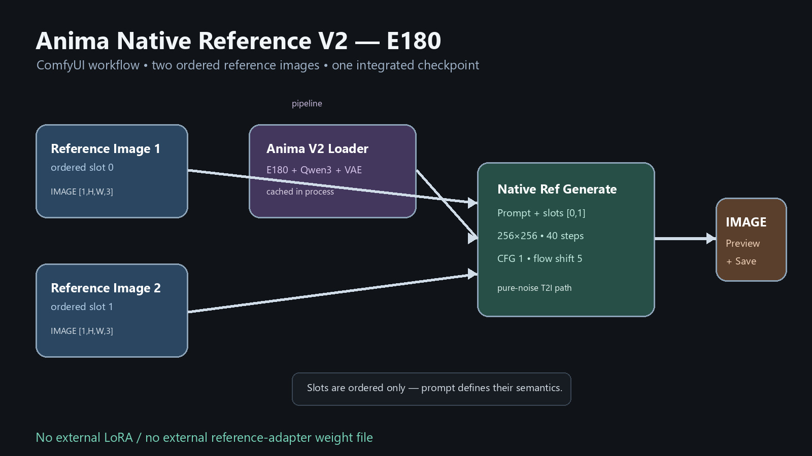

# ComfyUI — Anima Native Reference V2 (E180)

Research-preview ComfyUI custom nodes for the integrated **Anima Native
Reference V2 E180** checkpoint. The plugin performs true two-reference
generation through the model's native reference-latent sequence and V2
reference attention route.

It does **not** turn the model into img2img, does not use a stock KSampler, and
does not mount a second LoRA or reference-adapter weight file.



## What is included

| Node | Purpose |
|---|---|
| **Anima Reference V2 Loader (E180)** | Loads and caches the integrated E180 DiT, Anima Qwen3-0.6B text encoder, and Qwen-Image VAE. |
| **Anima Reference V2 Generate (2 Refs)** | Generates one image from prompt + two explicit ordered reference inputs. |

The package also includes:

- a drag-and-drop UI workflow:
  [`example_workflows/anima_ref_v2_e180.json`](example_workflows/anima_ref_v2_e180.json);
- a local `/prompt` API workflow:
  [`api_workflows/anima_ref_v2_e180_api.json`](api_workflows/anima_ref_v2_e180_api.json);
- the pinned, namespaced Anima inference runtime required by the new V2
  modules;
- fail-closed model-layout checks and optional full SHA256 verification;
- bounded model, prompt-embedding, and reference-latent caches.

## Reference semantics — important

The two inputs are:

```text
Reference Image 1 -> ordered slot 0
Reference Image 2 -> ordered slot 1
```

They are **not** hard-coded as `scene`, `identity`, `source`, or `style`.
Their order is preserved exactly, while the prompt states what the generation
should do with the two references. Each input currently accepts one image only
(`B=1` in Comfy's `[B,H,W,C]` IMAGE format). For animated or batched input,
select one frame first with `ImageFromBatch`.

Sampling begins from pure noise. Visual information enters through two VAE
reference latent streams and the checkpoint's native V2 reference route, so
there is intentionally **no denoise-strength widget**.

## Requirements

- Current ComfyUI with Python 3.10 or newer;
- NVIDIA CUDA GPU with BF16 support;
- enough host RAM for the cached runtime;
- the exact three release files listed below.

The first release is deliberately strict: it validates the E180, Qwen, and VAE
layouts instead of silently loading a similarly named but incompatible file.

## Installation

### 1. Install this custom node

Copy the whole directory into:

```text
ComfyUI/custom_nodes/ComfyUI-Anima-Native-Reference/
```

Install its extra Python dependencies using the same interpreter that starts
ComfyUI:

```bash
cd ComfyUI/custom_nodes/ComfyUI-Anima-Native-Reference
python -m pip install -r requirements.txt
```

Do not replace a working ComfyUI CUDA build of `torch`/`torchvision`; this
plugin's requirements intentionally do not pin or install PyTorch.

Restart ComfyUI after installation.

### 2. Place the three weight files

```text
ComfyUI/
└── models/
    ├── diffusion_models/
    │   └── anima-native-ref-v2-e180-step64080-256px.safetensors
    ├── text_encoders/
    │   └── qwen_3_06b_base.safetensors
    └── vae/
        └── qwen_image_vae.safetensors
```

#### Integrated E180 checkpoint

- File: [`anima-native-ref-v2-e180-step64080-256px.safetensors`](https://huggingface.co/LAXMAYDAY/NOOB2-Project-Character-Reference-Bypass-Injector-Research/blob/7f7269008a61db5db6d0d3d1f0cb4dcd03d65210/checkpoints/v2-e180/anima-native-ref-v2-e180-step64080-256px.safetensors)
- Destination: `ComfyUI/models/diffusion_models/`
- Bytes: `4,271,362,542`
- SHA256: `1f970a7867dd7b65858d30b58135134ce84fd3b552ab27fc9f07e7f15209c6dd`

The repository is manually gated. Accept its access conditions and authenticate
with Hugging Face before downloading. Keep access tokens outside scripts and
workflow JSON files.

#### Anima text encoder

- File: [`qwen_3_06b_base.safetensors`](https://huggingface.co/circlestone-labs/Anima/blob/main/split_files/text_encoders/qwen_3_06b_base.safetensors)
- Destination: `ComfyUI/models/text_encoders/`
- Bytes: `1,192,135,096`
- SHA256: `cd2a512003e2f9f3cd3c32a9c3573f820bb28c940f73c57b1ddaa983d9223eba`

#### Qwen-Image VAE

- File: [`qwen_image_vae.safetensors`](https://huggingface.co/circlestone-labs/Anima/blob/main/split_files/vae/qwen_image_vae.safetensors)
- Destination: `ComfyUI/models/vae/`
- Bytes: `253,806,246`
- SHA256: `a70580f0213e67967ee9c95f05bb400e8fb08307e017a924bf3441223e023d1f`

The Anima base assets have their own license. Downloading or using them means
you are responsible for following the upstream model terms.

## UI workflow

1. Drag `example_workflows/anima_ref_v2_e180.json` onto the ComfyUI canvas.
2. Choose one image in each `Load Image` node.
3. Confirm the loader has selected the exact E180, Qwen, and VAE filenames.
4. Write an instruction that says how both references should influence the new
   illustration.
5. Queue the prompt.

Validated defaults:

| Setting | Value |
|---|---:|
| Output size | `256 × 256` |
| Steps | `40` |
| CFG | `1.0` |
| Flow shift | `5.0` |
| Native reference scale | `1.0` |
| Maximum area per reference | `65,536` pixels |
| Logical slot IDs | `[0, 1]` |
| Attention mode | `torch` |

The checkpoint was trained with 256-pixel-area buckets. Larger multiples of 16
are accepted by the implementation, but should be treated as experimental
rather than as a validated quality promise.

### Prompt example

```text
Create a new anime illustration using both reference images. Preserve the
relevant character and visual details from Reference Image 1 and Reference
Image 2, and show the referenced character in a coherent new composition with
clean anime rendering and detailed eyes.
```

Do not assume the example wording assigns a permanent role to either slot; edit
the instruction for the actual pair and task.

## API workflow

`api_workflows/anima_ref_v2_e180_api.json` is in Comfy's API prompt format.
For a local Comfy server:

1. upload two images with `POST /upload/image`;
2. replace `reference_image_1.png` and `reference_image_2.png` in the two
   `LoadImage` nodes with the returned filenames;
3. send the JSON object as `prompt` to `POST /prompt`;
4. read the `SaveImage` result from history/output.

Minimal request body:

```json
{
  "prompt": { "...": "contents of anima_ref_v2_e180_api.json" },
  "client_id": "your-client-id"
}
```

The UI workflow and API workflow are intentionally separate formats.

## Memory modes and caching

| Mode | Behavior |
|---|---|
| `balanced` | Default. Keeps the DiT on GPU; moves Qwen and VAE onto GPU only for their phases. |
| `high_vram` | Keeps DiT, Qwen, and VAE on GPU for fastest repeated generation. |
| `text_encoder_cpu` | Encodes text on CPU; slow fallback when GPU memory is constrained. |

Model loading has two cache layers:

1. ComfyUI can cache the Loader node output;
2. the plugin also keeps a process-level, thread-safe, strong-reference LRU of
   the two most recently used runtimes.

Thus changing prompt, seed, reference image, or sampling settings does not read
the 4.27 GB checkpoint again. Prompt embeddings and preprocessed reference
latents also use bounded caches. The runtime serializes generation on one model
instance so a request cannot leak scale or device state into another request.

## What was verified

The packaged runtime was tested on an NVIDIA RTX PRO 6000 Blackwell using the
exact release files:

- full E180 + Qwen + VAE load completed;
- output was CPU `float32 [1,256,256,3]`, finite, and in `[0,1]`;
- 40-step reference generation completed with the validated settings;
- the generated-only result for held-out case `000052` was **pixel-identical**
  to the already accepted native CLI result when serialized with the same
  conversion (`max difference = 0`, `nonzero pixels = 0`);
- repeated loader calls returned the same cached runtime;
- the output contains only the generated image, not an evaluation contact
  sheet;
- Chinese and Japanese prompts remain Unicode instead of being corrupted by
  the historical CLI escape helper;
- foreign custom-node modules named `library` or `networks` remain untouched
  because all vendored imports use the private
  `_anima_native_ref_vendor` namespace.

Timing observed on that one machine was approximately 12.3 seconds for the
first full model load and 5.8 seconds for a 40-step 256×256 generation. These
numbers are an integration record, not a speed guarantee for other hardware.

## Limitations

- fixed at exactly two reference inputs and one image per input (`B=1`);
- publication runtime accepts the exact E180 release, not arbitrary Anima or
  future V2 checkpoints;
- CUDA BF16 only in the first release;
- no stock Comfy `MODEL`/`CLIP`/`VAE` outputs and no stock KSampler path;
- no dynamic N-reference frontend ports;
- 256 is the trained/validated resolution; larger output remains experimental;
- this is a research checkpoint and may still miss fine identity, pose, or
  compositional details on difficult pairs.

## Why an inference plugin is still required

"No external adapter" means there is only one integrated E180 model weight
file. It does **not** mean unmodified stock Anima code knows the newly added
V2 reference modules. This custom node supplies that inference implementation,
but it does not load a second learned adapter or LoRA file.

## Runtime provenance and licenses

- V2 runtime source is pinned to the project snapshot corresponding to
  `akatsuki-neo/anima-edit` commit
  `2ae811d296ff4159c6024c4a86415d19961a388c`.
- Vendored source/config files are integrity checked against
  `vendor/VENDOR_MANIFEST.json` before use.
- The Apache-2.0 license and upstream provenance are retained under `vendor/`.
- Model weights are distributed separately and remain subject to their own
  repository/model licenses and access conditions.

## 中文快速说明

1. 把整个插件目录放进 `ComfyUI/custom_nodes/`，用 ComfyUI 自己的 Python
   安装 `requirements.txt`，然后重启。
2. E180 放 `models/diffusion_models/`，Qwen3 放 `models/text_encoders/`，VAE
   放 `models/vae/`。
3. 拖入 `example_workflows/anima_ref_v2_e180.json`，选择两张参考图并运行。
4. `Reference Image 1/2` 仅表示有序槽位 `0/1`，**没有固定的场景图/身份图
   角色**；怎样使用两张图由 prompt 指令决定。
5. 这是从纯噪声开始的多参考生成，不是 i2i，所以没有去噪强度参数。
6. E180 是单文件集成权重，不需要再外挂 LoRA/Adapter；但原版 Anima
   推理代码不认识新增 V2 路径，因此仍需要本插件提供推理实现。

